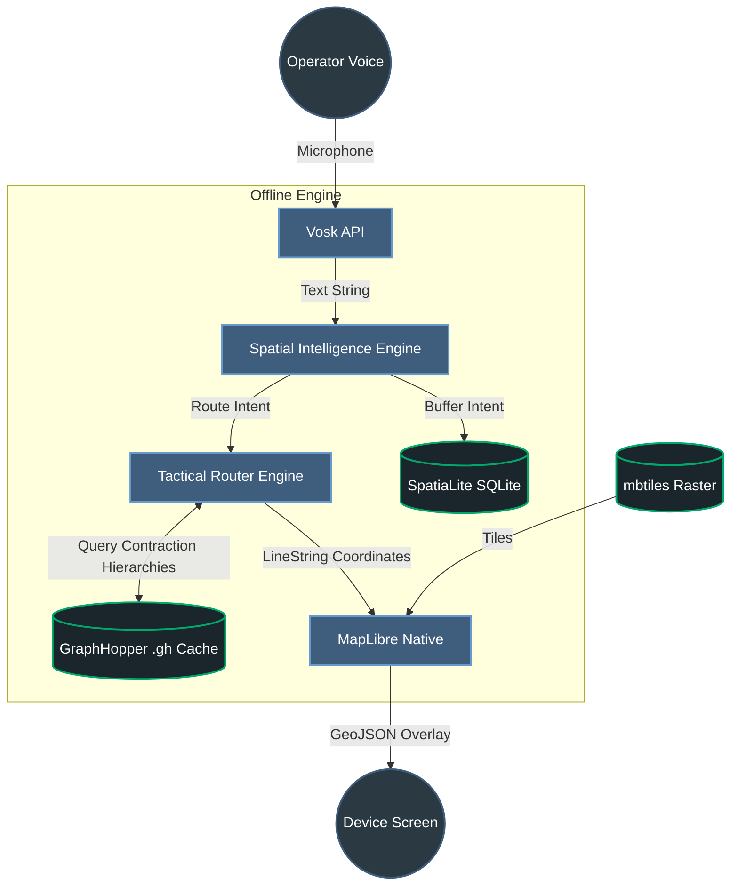

# Voice-Controlled GIS (Offline Tactical Map)

An advanced, **100% offline**, voice-controlled Android tactical mapping application built for high-stakes, off-grid environments such as defense operations, emergency response routines, and remote wilderness navigation. 

Instead of relying on cloud services, this app natively processes speech, renders massive terrain maps, and calculates high-speed routing graphs entirely on the edge device—ensuring total operational security and reliability when internet is unavailable.

---

## ✨ Key Features

*   **🎙️ Offline Voice Commands:** Native speech recognition to control the map hands-free. (e.g., *"Route to objective"* or *"Show friendlies within 5 km"*).
*   **🗺️ Local Raster Mapping:** Sub-second rendering of massive, custom tactical maps packed locally using `MBTiles`. No network roundtrips required.
*   **🧭 Edge Routing Intelligence:** Fully standalone navigation module using Contraction Hierarchies capable of identifying ultra-fast offline routes in milliseconds.
*   **📡 Spatial Analysis (WIP):** Geometric buffer generation powered by SpatiaLite, enabling dynamic tracking of operating ranges and Points of Interest.

---

## 🛠️ Technology Stack

Every component in this stack was exclusively chosen because it operates entirely without cloud APIs or internet connections:

### 1. MapLibre Native (The UI & Rendering Engine)
*   **Android / Kotlin:** The core container application.
*   **[MapLibre Native (Android)](https://maplibre.org/):** An open-source vector/raster engine. Instead of streaming tiles via the internet like Google Maps, it runs natively on the Android GPU. We point it to query a local SQLite database (`.mbtiles`) packed with thousands of tiny, pre-rendered geospatial images 60 times a second to ensure seamless map painting regardless of connectivity.

### 2. Vosk (The Voice Engine)
*   **[Vosk Speech Recognition](https://alphacephei.com/vosk/):** Unlike cloud assistants that process speech on remote servers, Vosk is a localized edge-computing toolkit. By embedding a small (~40MB) acoustic model directly into the app memory, Vosk leverages the hardware CPU to instantly transcribe unstructured microphone audio streams safely inside the device.

### 3. GraphHopper (The Routing Engine)
*   **[GraphHopper](https://github.com/graphhopper/graphhopper):** Pathfinding algorithms would normally freeze a mobile device if unleashed across an entire state's road network. GraphHopper solves this using **Contraction Hierarchies (CH)**. It takes an OpenStreetMap `.osm.pbf` file, calculates routing "shortcuts" offline on a desktop, and produces a highly compressed `.gh` cache bundle. The app can then calculate 100km routes in under 20 milliseconds on a standard Android phone.

### 4. SpatiaLite (The Intelligence Engine)
*   **[SpatiaLite]**(Simulated): Traditional databases only compare strings or integers, but tactical apps need geographic comparison (*e.g. Is an enemy unit inside the 5km radius of an outpost?*). SpatiaLite is a native C++ spatial extension for SQLite that allows us to perform on-the-fly computational geometry math (`ST_Buffer`, `ST_Intersects`) locally to build intelligent proximity alerts.

### ⚙️ The Pipeline in Action
1. **Vosk** listens, evaluates against the hardware acoustic model, and grabs the text string (e.g., *"route to objective"*).
2. **SpatialIntelligenceEngine** parses the intent and entity.
3. **GraphHopper** uses Contraction Hierarchies over the offline `.gh` dataset to instantly generate coordinate paths.
4. **MapLibre** intercepts those raw coordinates, converts them to a GeoJSON `LineLayer`, and paints a bright tactical track across the offline map.

### 🏛️ System Architecture Diagram

---

## 🚀 Setup & Installation Guide

Because this application runs entirely offline, it requires pre-compiled geographic and acoustic assets to be injected into the Android application BEFORE compiling. 

### 1. Download Vosk Acoustic Model
1. Download an Android-compatible Vosk acoustic model (e.g., `vosk-model-small-en-us`).
2. Extract the model contents and place them strictly into `/app/src/main/assets/models/model/`.

### 2. Prepare Map Data (`.mbtiles`)
1. Use **QGIS** (or alternative geospatial software) to define your tactical operating area. 
2. Export your map layers (including LULC or satellite imagery) into an MBTiles raster database.
3. Name the file `sample_tactical.mbtiles` and drop it into `/app/src/main/assets/mbtiles/`.

### 3. Generate Routing Graph (`.gh` folder)
1. Download your region's raw OpenStreetMap file (e.g., `eastern-zone-latest.osm.pbf`) from **Geofabrik**.
2. Download the GraphHopper Desktop `.jar`.
3. Process the file via terminal: `java -jar graphhopper-web-X.jar import your-region.osm.pbf`.
4. Copy the freshly generated `*-gh` folder and push it into the Android file cache (or into the `assets` folder for extraction) so the `TacticalRouterEngine` can compute geographic paths.

### 4. Build and Run
*   Open the project in **Android Studio**.
*   Let Gradle sync the MapLibre and Vosk dependencies.
*   Deploy onto a physical Android device (An emulator can be used, but Voice Recognition works best with a dedicated hardware microphone).
*   Accept Microphone Permissions on boot.

---

## 💬 Supported Voice Commands

Currently mapped fallback intents include:

| Intent | Voice Command Trigger | Action Performed |
| :--- | :--- | :--- |
| **Navigation** | *"Route to base"*, *"Navigate to objective"* | Triggers GraphHopper routing between the operator and the destination, drawing a red LineString overlay on MapLibre. |
| **Spatial Radius** | *"Show friendlies within 5 km"* | Computes an ST_Buffer ring via SpatiaLite around the designated entity coordinates at the exact range. *(In Progress)* |

--- 

## 🗺 Roadmap

- [x] Initial map rendering pipeline (MBTiles/MapLibre)
- [x] Acoustic model ingestion & text parsing (Vosk)
- [x] Integrate MapLibre dynamic line overlays for Route projection
- [ ] Connect compiled Contraction Hierarchy GraphHopper `.gh` bundles
- [ ] Full NLP entity-extraction using a lightweight TFLite model instead of regex
- [ ] Cross-compile Native SpatiaLite SQLite drivers

*Maintainer Note: Built as a Hackathon proof-of-concept for offline tactical tracking.*
