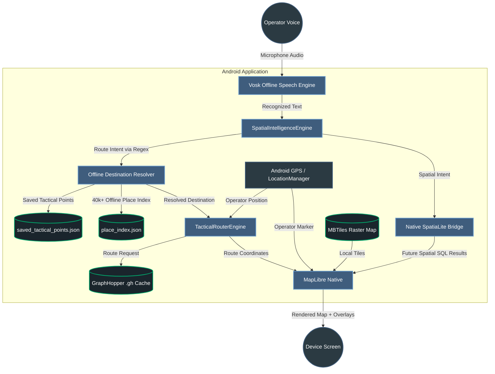

# Voice-Controlled GIS (Offline Tactical Map)

An Android tactical mapping prototype that runs fully offline on-device. The app combines local map rendering, offline speech recognition, offline route computation, offline destination lookup, and native spatial-analysis plumbing without requiring cloud APIs or internet connectivity.

The current build is no longer just a map demo. It now supports multi-region offline map packs, live GPS-based routing, tap-to-select destinations, saved tactical points, offline place-name routing, hazard-aware rerouting, team mesh sync, and a tactical Android UI layer built around the map.

---

## ✨ Current Capabilities

- **100% offline operation:** no cloud dependency for maps, routing, or speech commands.
- **Offline speech control:** Vosk listens on-device and sends recognized text into a deterministic command parser.
- **Offline tactical map rendering:** MapLibre renders local raster MBTiles without network access.
- **Multi-region asset packs:** Bengaluru, Siachen Border, and Line of Control can each load their own offline map and route graph bundles.
- **Live GPS routing:** Bengaluru routes start from the operator’s real phone location instead of demo seed coordinates.
- **Demo-region routing:** Siachen and Line of Control can use fixed in-region operator seed points so remote operational zones can still be demonstrated from anywhere.
- **Tap-to-route flow:** the operator can tap a destination on the map and then either tap `GET DIRECTIONS` or say `route to objective`.
- **Offline named destination routing:** the app can route to saved tactical points and offline indexed places by spoken name.
- **Forgiving offline destination phrases:** short commands such as `bank`, `hospital`, and known place names can be resolved through the offline place index without needing a full `route to ...` phrase every time.
- **Distance and ETA display:** the active route summary card shows total distance, remaining distance, and ETA.
- **Automatic rerouting:** if the operator deviates from the active route, the app recomputes a new route.
- **Hazard-aware routing:** tactical hazard zones can be marked and active routes are recalculated to avoid blocked areas when alternate graph paths exist.
- **Hazard persistence and sync:** hazard zones persist locally and can be mirrored across nearby teammates on the same local Wi-Fi / hotspot mesh.
- **Team mesh overlays:** teammate locations, stale/offline state, callsigns, and hazard broadcasts can be shared without internet.
- **Shake zoom shortcut:** a deliberate double-shake gesture can alternate zoom in / zoom out without removing normal finger pinch controls.
- **Refined tactical HUD:** the app now uses a more professional olive/amber defense theme, compact command cards, a structured top bar, branded drawer header, and a launcher icon tuned for better visibility on Android home screens.
- **Native spatial-analysis driver integration:** Android SpatiaLite native drivers are now packaged into the app and exposed through JNI for future spatial SQL workflows.

---

## 🧱 Tech Stack

Every major component was selected to work offline on Android.

### Android App Layer
- **Kotlin:** primary app logic, activity lifecycle, UI control, GPS handling, command parsing, and routing orchestration.
- **XML layouts:** Android UI structure for the tactical HUD, drawer, route summary card, destination panel, and splash screen.
- **Android SDK APIs:** permissions, location services, audio capture lifecycle, sensors, file extraction, caching, and local storage.

### Map Rendering
- **MapLibre Native (Android):** renders the local map and all route/marker overlays.
- **MBTiles raster package:** stores the offline visual map tiles used by MapLibre.
- **GeoJSON overlays:** route lines, destination markers, and operator location are pushed onto the map as dynamic layers.

### Voice Recognition
- **Vosk Android:** performs offline speech-to-text on the device using a bundled acoustic model.
- **Regex-first intent parser:** the app currently relies primarily on deterministic regex parsing for stable tactical commands.

### Offline Routing
- **GraphHopper Core:** computes routes on-device.
- **Contraction Hierarchies graph cache (`.gh`):** preprocessed road network data zipped into Android assets and unpacked on first run.
- **OpenStreetMap extract (`.osm.pbf`):** raw road data used offline during desktop preprocessing.

### Offline Destination Lookup
- **`place_index.json`:** the app’s offline searchable place database generated from map data. This contains roughly **40,000+ indexed places**.
- **`saved_tactical_points.json`:** mission-specific named points such as `base`, `extraction`, `checkpoint alpha`, `safe zone`, and `medical point`.
- **Region tactical point packs:** region-specific saved points such as `siachen_saved_tactical_points.json` and `line_of_control_saved_tactical_points.json`.
- **Fuzzy and alias matching:** the lookup layer can recover from common local-name variations and category-style phrases like `nearest hospital`.

### Hazard and Team Sync
- **HazardZoneManager:** local circle-based tactical no-go zones with map overlay rendering and GraphHopper blocked-area export.
- **UDP local mesh service:** peer position + hazard sync on the same hotspot/Wi-Fi network without internet.
- **Team state manager:** teammate freshness tracking, stale-member aging, and sidebar/team-overlay rendering.

### Native Spatial Analysis
- **Android SpatiaLite package:** packaged native spatial SQLite wrapper for Android.
- **C++ / JNI bridge:** native bridge layer added through Android NDK + CMake for future spatial SQL execution.
- **SpatiaLite workflow status:** driver integration is done; higher-level spatial buffer visualization is still being expanded.

---

## 🧠 Voice Command Pipeline

This is the most important part of the current system architecture.

### 1. Speech Recognition
Vosk receives microphone audio and converts it to text locally on the device.

Example:
- spoken: `route to hebbal`
- recognized text: `route to hebbal`

### 2. Regex-First Intent Parsing
The recognized text is passed into `SpatialIntelligenceEngine`, which uses **regex as the primary parser**.

Regex currently handles command families such as:
- `route to ...`
- `clear route`
- `clear destination`
- `recenter on me`
- `show friendlies within 5 km`

This regex-first design is currently preferred over TFLite because it is more stable for the bounded tactical command set used by the app.

### 3. Destination Extraction
For route commands, the parser captures the **entire destination phrase**, not just a hardcoded keyword.

Example:
- `route to base`
- `route to checkpoint alpha`
- `route to nearest hospital`
- `route to hebbal`

The destination phrase is passed into the offline destination resolver.

### 4. Offline Place Resolution
The app does **not** store 40,000 places inside regex itself.

Instead:
- **regex decides the intent**
- **offline lookup resolves the destination**

The lookup layer uses:
- `saved_tactical_points.json` for mission-specific tactical destinations
- `place_index.json` for the larger offline indexed place database
- alias normalization
- category expansion
- nearest-category search
- fuzzy string matching

So:
- `regex` answers: **what action is being requested?**
- `offline place index` answers: **which real location does that phrase refer to?**

### 5. Route Construction
Once a destination is resolved:
- the app uses the current live GPS location as the route start
- GraphHopper computes the route on-device
- MapLibre renders the route as an overlay on the offline map

### 🏛️ System Architecture Diagram



---

## 🗺 Map and Data Pipeline

The app has two different offline geospatial layers:

### Visual Map Layer
- source data prepared externally
- exported into region-specific MBTiles packages
- copied locally at runtime
- inspected and unpacked into raster tiles
- rendered by MapLibre

### Routing Graph Layer
- OpenStreetMap road data is processed with GraphHopper on desktop
- GraphHopper produces a `.gh` route graph cache
- the cache is zipped into region-specific graph bundles
- the app unpacks it on first run
- GraphHopper routes against this local graph

### Destination Index Layer
- `place_index.json` contains the offline place-search dataset
- `saved_tactical_points.json` contains tactical destinations
- both are consumed by `OfflinePlaceIndex.kt`

---

## 🖥️ Tactical UI Elements

The Android UI has been expanded well beyond the original simple overlay.

### Top Bar
- hamburger menu button
- integrated emblem + title stack
- mission subtitle
- active region badge with compact chip styling
- dedicated operator recenter control

### Left Navigation Drawer
- region shortcuts
- tactical controls
- map recenter action
- clear route / clear destination / clear hazards actions
- team mesh status and callsign controls
- region switching for Bengaluru, Siachen Border, and Line of Control

### Route Summary Card
- destination label
- total route distance
- remaining distance
- ETA
- route progress bar
- route status chip (`on route` / rerouting-style states)

### Destination Panel
- selected destination name
- destination coordinates
- distance from current operator position
- `GET DIRECTIONS` action
- clear destination action

### Operator Feedback HUD
- live transcription/status text
- microphone status indicator
- route success/failure messages
- GPS/zone validation messages

### Map Overlays
- operator location marker
- destination marker
- route polyline
- hazard polygons
- teammate markers and callsign labels

### Utility Controls
- floating rotating compass button that visually tracks map bearing and snaps back to north on tap
- hazard placement FAB
- splash screen / launcher branding
- app launcher icon based on the Veer Rakshak emblem

### UI Design Direction
- dark olive and muted amber military palette instead of generic dark-mode tones
- compact HUD cards with rounded corners and thin tactical outlines
- branded drawer header with tighter spacing and emblem-first hierarchy
- curved / semicircle control plates for the emblem and compass controls
- reduced visual duplication between the floating compass and top-bar recenter action

---

## 📌 Supported Navigation Behaviors

The app currently supports all of the following:

- route from live GPS to a tapped destination
- route from live GPS to `objective`
- route from live GPS to saved tactical points
- route from live GPS to indexed offline place names
- route from live GPS to category-style place requests such as `nearest hospital`
- clear route by voice
- clear destination by voice
- recenter on operator by voice
- show remaining distance and ETA
- reroute automatically on deviation
- place hazard zones by voice or by map interaction
- clear hazards by voice or UI
- share hazards across nearby teammates on local mesh
- show teammate live / stale status on the map and in the drawer
- use deliberate shake gestures for alternating zoom in / zoom out

Examples:
- `route to objective`
- `route to base`
- `route to extraction`
- `route to checkpoint alpha`
- `route to hebbal`
- `route to nearest hospital`
- `clear route`
- `clear destination`
- `recenter on me`
- `hostile area here`
- `flood zone here`
- `blast radius here`
- `blocked road here`
- `restricted zone here`
- `clear hazards`

---

## 📡 Spatial Analysis Status

The native SpatiaLite driver layer is now integrated into the Android build through:
- packaged Android SpatiaLite dependency
- JNI bridge
- CMake / NDK integration
- runtime native-library probing

What is done:
- driver packaging
- native bridge scaffolding
- Android ABI integration

What is still expanding:
- executing full spatial SQL workflows from Kotlin
- emitting actual buffer/intersection results onto the map
- richer tactical analysis overlays

So the **driver task is complete**, while the **full spatial-analysis UX** is still a future enhancement area.

---

## 🛠️ Setup

Because the project is offline-first, several assets must exist locally before running a full build.

### 1. Vosk Acoustic Model
Place the extracted Vosk model contents in:

- `app/src/main/assets/models/model/`

### 2. Offline Map Package
Place the raster map package(s) in:

- `app/src/main/assets/mbtiles/bengaluru_full.mbtiles`
- `app/src/main/assets/mbtiles/siachen_border.mbtiles`
- `app/src/main/assets/mbtiles/line_of_control.mbtiles`

### 3. GraphHopper Cache
Place the zipped GraphHopper route cache(s) in:

- `app/src/main/assets/graphhopper/bengaluru_full-gh.zip`
- `app/src/main/assets/graphhopper/siachen_border-gh.zip`
- `app/src/main/assets/graphhopper/line_of_control-gh.zip`

### 4. Optional Intent Model
If you want to experiment with TFLite classification, place:

- `app/src/main/assets/models/nlp_intent.tflite`
- `app/src/main/assets/models/nlp_intent_labels.txt`
- `app/src/main/assets/models/nlp_intent_vocab.json`

The app is still designed to work without this because regex remains the primary parser.

### 5. Build

```bash
./gradlew assembleDebug
```

Deploy to a physical Android device for best microphone and GPS behavior.

---

## 🗺 Roadmap

- [x] Initial map rendering pipeline (MBTiles/MapLibre)
- [x] Acoustic model ingestion & text parsing (Vosk)
- [x] Integrate MapLibre dynamic line overlays for Route projection
- [x] Connect compiled Contraction Hierarchy GraphHopper `.gh` bundles & automated unzipper
- [x] Validate offline route computation and render route overlays on-device
- [x] Localize demo assets for the BMSIT operating zone
- [x] Replace the current demo route seed coordinates with live GPS operator positioning
- [x] Add tap-to-select destination routing on the offline map
- [x] Surface route distance and ETA inside the Android UI
- [x] Add voice controls for route clearing, destination clearing, and recentering
- [x] Cross-compile Native SpatiaLite SQLite drivers
- [x] Add named destination routing for saved tactical points and offline place lookup
- [x] Track remaining distance/ETA and reroute when the operator deviates from the path

---

## 📌 Current Status

The roadmap implementation is complete. The project now runs as an advanced offline Android prototype with:
- offline map rendering
- offline speech recognition
- regex-first command parsing
- offline destination-name routing
- live GPS routing
- region-specific offline asset packs
- route progress/ETA tracking
- automatic rerouting
- hazard-aware route avoidance
- local team mesh sync
- packaged native SpatiaLite driver support
- expanded tactical UI controls

The next engineering phase moves beyond the roadmap into:
- refining full Bengaluru performance and coverage
- deeper region-specific place packs for Siachen and Line of Control
- deeper tactical spatial overlays and analysis visualization

*Maintainer Note: Built as a hackathon proof-of-concept for secure offline tactical mapping and navigation.*
